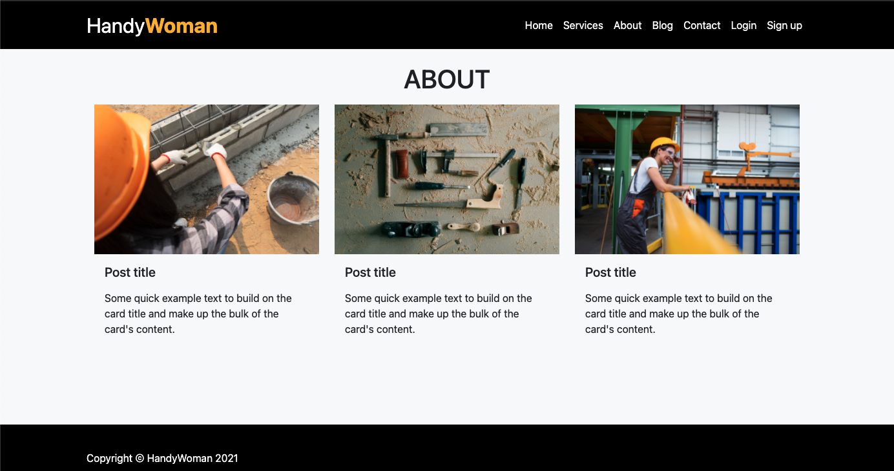
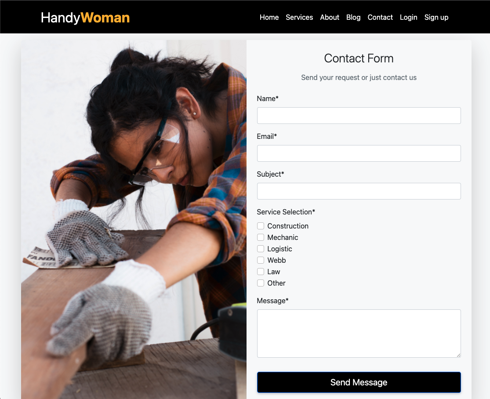
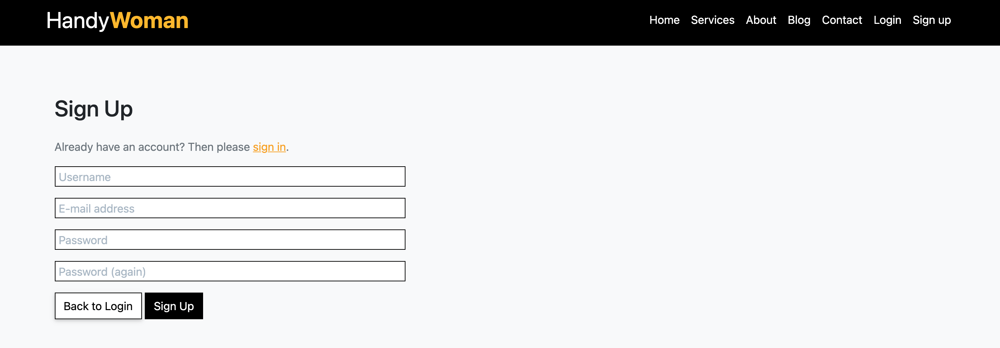
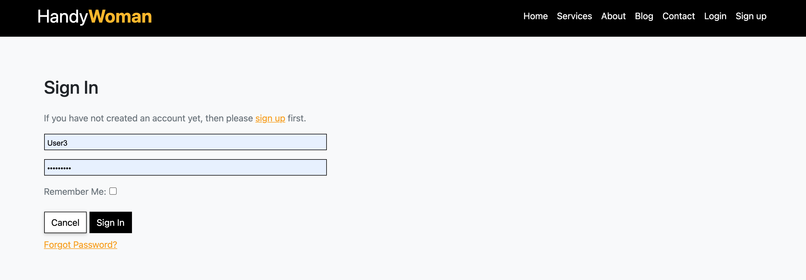

# HANDYWOMAN

## Full Stack Frameworks with Django

  

---

## Project Summary

Handywoman is a site that connect handy women with other handy womens. The site contains a blog page where news, interesting articles, tips and handy trick can be read and commented on. The site also provides a contact form where users can request help / services from handy women.  

This project is my milstone project 4 for Code Institute and is for educational purposes only.

Feel Free to visit the live website: [Handywoman](https://handywoman.herokuapp.com/) 

---
# Table of contents

- [UX](#ux)
    - [Strategy](#strategy)
    - [Scope](#scope)
        - [User stories](#user-stories)
    - [Structure of the website](#structure-of-the-website)
        - [Database schema](#database-schema)
    - [Skeleton](#skeleton)
    - [Surface](#surface)
- [Features](#features)
- [Technologies used](#technologies-used)
- [Testing](#testing)
- [Deployment](#deployment)
- [Credits](#credits)

---
# UX

## Strategy

The purpose of this project is to build a site where women connect and exchange knowledge and services

 

## Scope

Based on the requirements of achieving user's and owner's goals and stories, below is the list of required pages with the features and functions:

- Simple design landing page that the purpose of the website is obvious to anybody and even first-time users know how to navigate the website. 
- Services page where users can view all the services the site provides.
- Blog page where user can read and comment on the latest post / news.
- About page where users can get information about the site and what it provides.
- Contact page where users can contact the admin of the site or to send a quotation,
- Checkout success page where users get confirmation of purchase
- Login / register page where users can log in or register.
- Logout function that users can safely log out the website and takes users back to the home page.
- Blog page management (admin only) where admin can add, edit, approve and delete content.

### User Stories

**ID** | **As a/an** | **I want to be able to...** | **So that I can**
--- | --- | --- | ---
1 | Site User | find responsive ,rich media , with a simple navbar | have a nice user experience
2 | Site User | easily navigate through the website | understand what this website provide
3 | Site User | view a list of services | select one to that suits
4 | Site User | view services details | see description and ask for a qoute
5 | Site User | read blog post about news and tips | get new ideas and get inspired
6 | Site User | like and comment on posts | share experience and be part of the community
7 | Site User | sign up as a member | comment and share experience
8 | Site User | contact the aministrator of the site | get more information
9 | Site User | get a quotation for service | get information about costs or ask other questions
10 | Administrator | have access to all the functionalities available as a simple user | controll the site and its content
11 | Administrator | add new content | keep the site up to date
12 | Administrator | create, read, update and delete blog actions | manage my site content
13 | Administrator | approve or disapprove comments| filter out objectionable comments

 

## Structures of the website

### Database Schema

PostgreSQL was used when deployed through Heroku. The Data Model below was created using [app-mockup](https://app-mockup.com/).

- [Database Schema](media/database_schema.png)

### Blog App

 

#### Post Model

| Name            | Database Key   | Field Type          | Validation                                                                   |
| --------------- | -------------- | --------------------| -----------------------------------------------------------------------------|
| Title           | title          | CharField           | max_length=200, unique=True,                                                 | 
| Author          | author         | ForeignKey          | User, on_delete=models.CASCADE,related_name='blog_posts'                     |
| Featured Image  | featured_image | ImageField          | CloudinaryField('image', default='placeholder')                              |
| Exerpt          | exerpt.        | TextField.          | blank=True,                                                                  |
| Updated On      | updated_on     | DateTimeField       | auto_now=True,                                                               |
| Content         | content        | TextField           |                                                                              |
| Created On      | created_on     | DateTimeField       | auto_now_add=True,                                                           |
| Status          | status         | IntegerField        | choices=STATUS, default=0                                                    |
| Likes           | likes          | ManyToManyField     | User, related_name='like', blank=True                                        |
| Like Count      | like_count     | IntegerField        | default=0                                                                    |

 

#### Comment Model

| Name            | Database Key   | Field Type          | Validation                                                                   |
| --------------- | -------------- | --------------------| -----------------------------------------------------------------------------|
| Post            | post           | ForeignKey          | Post, on_delete=models.CASCADE,related_name="comments"                       |
| User            | user           | CharField           | max_length=80                                                                |
| Body            | body           | TextField           |                                                                              |
| Created On      | created_on     | DateTimeField       | auto_now_add=True,                                                           |
| Approved        | approved       | BooleanField        | default=False                                                                |

 

### Contact App

 

#### Contact Model

| Name            | Database Key   | Field Type          | Validation                                                                   |
| --------------- | -------------- | --------------------| -----------------------------------------------------------------------------|
| Name            | name           | CharField           | required=True, max_length=90                                                 | 
| Email           | email          | EmailField          | required=True                                                                |
| Subject         | subject        | CharField           | required=True, max_length=40                                                 |
| Handy Service   | handyService   | MultipleChoiceField | required=True,widget=forms.CheckboxSelectMultiple,choices=HANDY_SERVICES,    |
| Message         | message        | CharField           | required=True, widget=forms.Textarea(attrs={"rows":4))                       |

 

Website contains:
- Navigation bar is fixed and collapse to burger icon on mobile devices with essential links to navigate on the website.
- The home page first view will be simple in structure with a short text intro. 
- Below it will contain some information about services and a about snippet with a testimonial carousel. 
- The services page will contain information of what the services can be requested.
- The blog page contain a smaller blog where users can read articles and logged in user can comment.
- The about page will contain information of what the site provides and some information about the site ethos.
- The contact page / request is a clean and simple contact.
- The footer will contains social media links.

 

## Skeleton

### Wireframes

The website is created as a desktop-first because it is easy to picture the whole image of the website, however, it is a fully mobile responsive website as well so users using a mobile phone have no difficulties toggeling the site. Below are the wireframes of the core pages of the website.

- [Desktop](media/wireframe_desktop.png)
- [Tablet](media/wireframe_tablets.png)
- [Mobile](media/wireframe_mobile.png)

  

## Surface

### Design

A custom CSS file, placed within the static folder of Handywoman, was used in conjunction with Bootstrap, which serves as the main CSS library. The site is built in dark mode and where I changed the dark theme to basic black. The fonts used are from fontawsome and is built in css file. 

 

### Media 
Pictures used in this site are taken from:
- [Freepik](https://freepik.com/)
- [Pexels](https://www.pexels.com/)
- [Unsplash](https://unsplash.com/)

---
# Features:

## Existing Features:

 

### Base

The landing page contains two background image with diffrent styles and some text and call to action buttons. 

 

### Navbar

The navigation bar at the top of each page of the website enables the user to easily access all pages of the website. On smaller devices, the navbar transforms into a burger menu, where links are only visible in a dropdown menu.

 

### Services Selection

This is where the users can read more detailed information about services that offers. The services card displays a button from where the users will have a direct access to the contact/request page.

 

### About Us

This is where the users can read more detailed information about what the site is about and who the persons behind it are. 

 

### Blog Page

The blog page displays an overview of all published blog posts for readers to scroll through. It also has a sidebar panel with a welcome message to users to tell them more about the blog and how often to come back for new blog posts. Logged in users can also comment on posted articles. Before comments are posted on the site they have to be approved by the admin. 

 

### Contact Page

On the contact page, a form is available for the user to send messages to the admin of the site or to send a request for service. The form contain the fields Name, email, subject, service sellection and message. 

 

### Sign up a new user

When accessing the sign up screen, the user must choose a username, password and fill in a email for access to the commenting on the blog-platform.

 

### User Login

On the login screen, the user is asked to fill in his/her login and password for access. 

 

### Blog Management

The blog management are only accessible to the admin of the website. The admin must approve comments before they are posted. The admin can edit, delete, and add blog posts. 

 

## Features Left to Implement:

- Register as a supplier/business for advertisment and to receive quotations.  
- Payment options (for supplier) different typ off packages.
- Search option for user so they can search directly after a Pro.
- A chat function were logged in users directly can ask questions.

 

----
# Technologies Used:

## Languages, framework libraries and programs:
- [HTML5](https://en.wikipedia.org/wiki/HTML) - For markup
- [CSS3](https://en.wikipedia.org/wiki/CSS) - For style
- [JavaScript](https://en.wikipedia.org/wiki/JavaScript) - For interaction
- [Python3](https://www.python.org/) - As a backend programming language
- [Django](https://www.djangoproject.com/) - As the main framework of Python
- [SQLite](https://www.sqlite.org/index.html) - As a database in development mode
- [PostgreSQL](https://landing.aiven.io/en/aiven-for-postgresql/) - As a database in production mode
- [Startbootstrap](https://startbootstrap.com/) - For the mainframe of the website
- [Getbootstrap](https://getbootstrap.com/) - For containers and layout
- [MDBootstrap](https://mdbootstrap.com/) - For card snippets
- [Cloudinary](https://cloudinary.com/) - For storage of media and images
- [Google Fonts](https://fonts.google.com/) - For fonts
- [Font Awesome](https://fontawesome.com/) - For icons
- [Gitpod](https://www.gitpod.io/) - As Integrated Development Environment (IDE)
- [Git](https://git-scm.com/) - For local version control, keeping the files & documents
- [GitHub](https://github.com/) - For online version control and keeping the files & documents
- [Heroku](https://www.heroku.com/) - For deploying the website
- [Balsamiq](https://balsamiq.com/) - For wireframes
- [Am I responsive](http://ami.responsivedesign.is/) - For mockup

---  
# Testing:

## Testing User Stories (UX Section):

1. Goal: As a Site User, I want to be able to find responsive, rich media, with a simple navbar so that I can have a nice user experience.

    Expected: When the user accesses the website they should be presented with a landing page that presents the main ideas behind the website as well as highlight the most important links.

    Result: The website is designed to be clean and straight to the point. Navigation bar enables the user to visit different pages on the website with ease. Action buttons link to relevant page, content and functions.

 

2. Goal: As a Site User, I want to be able to easily navigate through the website so that I can understand what this website provide.

    Expected: When the user accesses the website there should be a visible navigation structure and a consistent UX design.

    Result: Reaching the landing page the user is presented with a big representive hero image. The landing page contains two sections with information and action buttons linking to the service page and about page. There´s also a testimonial snippet with reviews from users of the site.

 

3. Goal: As a Site User, I want to be able to view a list of services so that I can select one to that suits.

    Expected: The user should be able to view all the services available at once.

    Result: The user can navigate to the service page. The service page will be populated with all of the services present.

 

4. Goal: As a Site User, I want to be able to view services details so that I can see description and ask for a qoute.

    Expected: The user should be able to click on a service card to be brought to the specific service details page, where more details about the service will be available.

    Result: When clicking a service, a detailed view of the specific service is shown with more information and ther´s a action button that links to a contact form.

 

5. Goal: As a Site User, I want to be able to read blog post about news and tips so that I can get new ideas and get inspired.

    Expected:

    Result: The user is able to access the blog via the blog link in the top navbar. Once on the blog page, the user is then able to view individual posts by clicking on the "Read More" call-to-action button.

 

6. Goal: As a Site User, I want to be able to like and comment on posts so that I can share experience and be part of the community.

    Expected: From the blog page, the user should be able to engage and comment on any of the posts.

    Result: From the blog page, the user can comment on posts if they are logged in. There´s a textarea input field with a clear and submit button. If the user enters a comment in the field and selects the submit button a messege will appear that the comment first has to be approved by the admin.

 

7. Goal: As a Site User, I want to be able to sign up as a member so that I can comment and share experience.

    Expected: The user should be able to sign up a membership to provide more access to certain aspects of the website.

    Result: The user can select the sign up link on the navbar. Upon navigating to the page the user can fill in the form to submit and create a membership.

 

8. Goal: As a Site User, I want to be able to contact the aministrator of the site so that I can get more information.

    Expected: The user should be able to click on the contact link in the navbar to be directed to the about page, where more information is provided.

    Result: The user can click on the contact link present in the navbar to be navigated to the About page. When on the about page the user is presented with three posts of information about the company's actions.

 

9. Goal: As a Site User, I want to be able to get a quotation for service so that I can get information about costs or ask other questions.

    Expected: The user should be able to click on the contact link in the navbar to be directed to the contact form.

    Result: The user is able through the navbar and other direct links to get to the contact page/form.

 

10. Goal: As a Administrator, I want to be able to have access to all the functionalities available as a simple user so that I can controll the site and its content.

    Expected:  The site owner should be able to have access to all the functionalities available as a simple user to controll the site and its content.

    Result: The admin can do exactly the same things as simple user.

 

11. Goal: As a Administrator, I want to be able to add new content so that I can keep the site up to date.

    Expected: While signed in as a admin, the admin should be able to add new content directly from the site. 

    Result: While signed in as a admin, the admin is able to add new content to the blog directly from the site. Other content needs to be added from the database.

 

12. Goal: As a Administrator, I want to be able to create, read, update and delete blog actions so that I can manage my site content.

    Expected: While signed in as an admin, the admin should be able to add/edit and delete a blog post directly in the blog page.

    Result: While on the blog page the admin can choose to add / edit or delete posts.

 

13. Goal: As a Administrator, I want to be able to approve or disapprove comments so that I can filter out objectionable comments.

    Expected: While signed in as a admin, the admin should be able to approve or delete any comment on the blog.

    Result: From the admin site, the admin must approve the comment from the database before its posted to the blog.

 

## Automated Testing:
- [W3C Markup Validation Service](https://validator.w3.org/) - For testing HTML code.
    - No errors.
- [W3C CSS Validation Service](https://jigsaw.w3.org/css-validator/) - For testing CSS code.
    - 1 error: 
- [PEP8 Online](http://pep8online.com/) - For checking Python PEP8 requirements. 
    - No errors.
- [JSHint](https://jshint.com/) - For checking Javascript code.
    - No errors. 
    - 2 warnings were ignored: 'let' is available in ES6 (use 'esversion: 6') or Mozilla JS extensions (use moz).
- [Chrome DevTools](https://developers.google.com/web/tools/chrome-devtools) - For testing, style checking and debugging.

 

## Manual Testing:

### This project was tested with the following browsers: 
- Laptop MacOS Big Sur (ver 11.4): Google Chrome
- Mobile OnePlus Pro 9: Google Chrome

 

### The following steps were taken:
All links, required fields, buttons, sorting function, carousel, forms, blog posts, all drop-down menus, product display, product detail and search bar work as expected.

- Manually testing via Devtools 
- Non-logged in user attempting to access content (refused)
- All buttons and links tested - works
- Users availing of the like button - works
- Image uploads tested - works as admin
- Form tested with correct and incorrect detail - works
- Clear user experience & navigation - works
- Picture loading speed
- Login/register/logout functionalities - works
- Alert messeges shown when logged in/out - works
- Alert messeges shown when a non logged in user trying to like a blog post  - works
- Edit, add, delete items & posts functionalities - works when logged in
- bugs or disabled links

 

### Issues / Unfixed Bugs:

- Like button not working properly with hovering as well as counting likes - Fixed 
- Amount of comments from the blog page is not shown - Not fixed
- Testimonial carousell indicators doesnt float within the testimonial card on smaller devices - Indicators removed - carousell fixed
- When running CSS validator there is alot of warnings depending on the full bootstrap theme choosen. - Not fixed
- I had issues with making the contact post - Fixed.
- All through I had many issues to make it work as I planned for in the beginning. The main reason for that depends on that I choosed to go with a template instead of doing it all by my self from scratch. I discoverd during the way that it took me much more time to try to change the prewritten scripts then it would have done if I just started from scratch. All though it has been a good experience with alot of lessons.

---
# Deployment

## Setting up
---
The website of this project requires back-end technologies such as server, application, and database so the website is deployed in [Heroku](https://www.heroku.com/), which is a cloud platform with a service supporting several programming languages, because GitHub can only host a static website. Heroku Postgres is used for the database, which is also a cloud-based platform, is used to store static files and images as Heroku has [no files system to store new files

 

## Setting up Heroku App
---
- Create an app in Heroku. Click *New*, put App name and select region.
- Add Heroku Postgres for the database.
- Install `gunicorn`, `dj_database_url` and `psycopg2-binary` to use Heroku Postgres, and run `pip3 freeze > requirements.txt` command to add them on requirments.txt.
- Update `settings.py` of the app. Import `dj_database_url`, comment out sqlite databases and add dj databases variable temporary while the database is transferred to Heroku Postgres.
- Run `python3 manage.py showmigrations` command to see the status of migrations (Currently not migrated). Run `python3 manage.py migrate` command to migrate.
- Create a super user with `python3 manage.py createsuperuser` command for product admin.
- Create a **Procfile** which specifies the commands that are executed by the app on startup.
- Temporary disable collectstatic by setting `heroku config:set DISABLE_COLLECTSTATIC = 1` and host name of Heroku to allowed hosts in `settings.py`.
- Generate a new secret key, set it up in Heroku and update `settings.py`. Change the setting of Debug mode that only True in Development mode.

 

## Deployment through Heroku
---
- Navigate to the "Deploy" section.
- Scroll down to "Deployment Method" and select "GitHub".
- Authorize the connection of Heroku to GitHub.
- Search for your GitHub repository name, and select the correct repository.
- For Deployment there are two options, Automatic Deployments or Manual.
- Automatic Deployment: This will prompt Heroku to re-build your app each time you push your code to GitHub.
- Manual Deployment: This will only prompt Heroku to build your app when you manually tell it to do so.
- Ensure the correct branch is selected "master/Main", and select a deployment method. For this project I chose Manual Deployment.

 

## How to Fork the respository
---
- Log into GitHub.
- In Github go to (https://github.com/Sndrahel/Handywoman.git).
- In the top right hand corner click "Fork".
- A copy of the repository will then be added to your repositories page.

 

## How to clone the repository
---
- Go to the GitHub repository.
- Locate the Code button which is to the left of the green gitpod button and click it.
- Select if you prefer to clone using HTTPS, SSH, or Github CLI and click the copy button to copy the URL to your clipboard.
- Open Git Bash.
- Change the current working directory to the one where you want the cloned directory.
- Type git clone and paste the URL from the clipboard.
- Press Enter to create your local clone.

 
---
# Credits

## Code:
- [Code Institute](https://codeinstitute.net/) - Inspiration of blog layout were taken from tutorial.
- [Youtube](https://www.youtube.com/results?search_query=python+django+dentist+website+%237) - Tutorial used for setting up sending email .  
- [Startbootstrap](https://startbootstrap.com/) - Core template layout contact form taken from this site.
- [Stack Overflow](https://stackoverflow.com/) - Was used to find solutions and debugging.
- [GitHub](https://github.com/Toto-Kotaro-Tanaka/ms4-eagle-golf) - Inspiration of structure for this README file were adapted from this site. 
- [GitHub](https://github.com/zackgithuboriginal/trestore-milestone-project-4) - Inspiration of structure for this README file and testing layout were adapted from this site. 
- [GitHub](https://github.com/rodrigoneumann/photographer-ms4) - Inspiration of structure and contactforms were adapted from this site. 
- [GitHub](https://github.com/ZahraSadiq/Milestone4-PosterBay) - Inspiration of layout for main site were adapted from this site.
 
 

## Acknowledgments:

- Nishant Kumar: My Code Institute mentor who guided me through this process and shared a lot of valuable knowledge.

[Back to Table of contents](#table-of-contents)

